# BritMart Retail Data Platform

> **Project status:** Complete. The platform has been implemented and validated end-to-end across multi-source ingestion, Bronze, Silver, Gold, data quality, reconciliation, operational monitoring, semantic modelling and Power BI reporting. Final GitHub portfolio documentation is being completed.

BritMart Retail Data Platform is a production-oriented reference implementation of a modern retail data platform built around Microsoft Fabric.

The project models a fictional UK omnichannel retailer operating physical stores and e-commerce channels, supported by distribution centres, suppliers, procurement processes and logistics operations.

The objective was not simply to build dashboards. The platform was designed to demonstrate how heterogeneous operational systems can be integrated into a governed, metadata-driven analytical platform with incremental processing, data-quality controls, reconciliation, auditability, monitoring and dimensional modelling.

---
## Table of Contents

- [Architecture](#architecture)
- [Source Systems](#source-systems)
- [Supplier Source System — FastAPI & PostgreSQL](#supplier-source-system--fastapi--postgresql)
- [Metadata-Driven Ingestion](#metadata-driven-ingestion)
- [Control Framework](#control-framework)
- [Bronze Layer](#bronze-layer)
- [Silver Layer](#silver-layer)
- [Silver Data Quality](#silver-data-quality)
- [Silver Reconciliation](#silver-reconciliation)
- [Gold Analytical Layer](#gold-analytical-layer)
- [Operational Monitoring](#operational-monitoring)
- [End-to-End Orchestration](#end-to-end-orchestration)
- [Semantic Model](#semantic-model)
- [Power BI Reporting](#power-bi-reporting)
- [Git & Engineering Workflow](#git--engineering-workflow)
- [Technology Stack](#technology-stack)
- [Repository Structure](#repository-structure)
- [Key Engineering Decisions](#key-engineering-decisions)
- [Security](#security)
- [Portfolio Scope](#portfolio-scope)

## Architecture

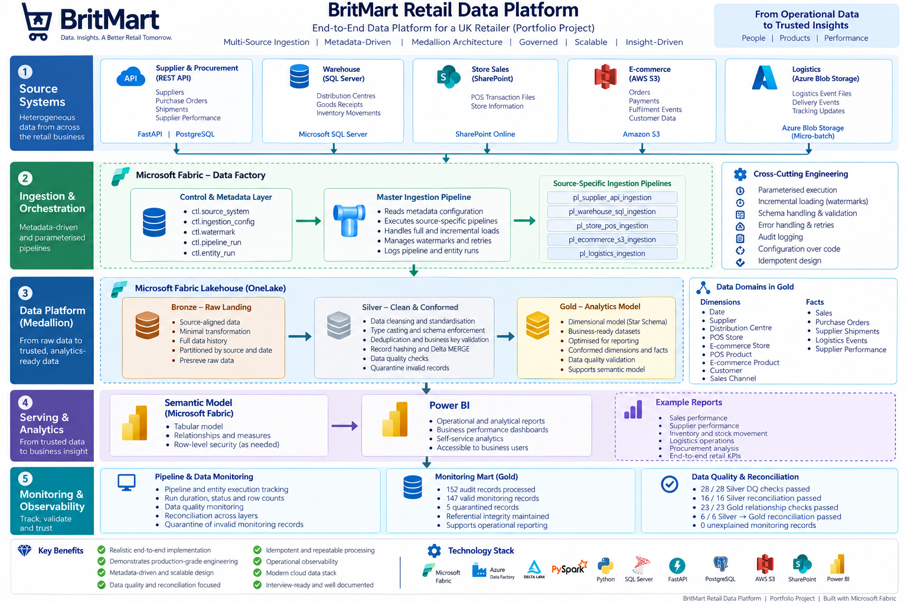

The platform follows a Medallion Architecture:

```text
Operational Source Systems
        ↓
Metadata-Driven Ingestion
        ↓
Bronze — Raw / Source-Aligned
        ↓
Silver — Validated / Conformed
        ↓
Gold — Dimensional / Analytical
        ↓
Semantic Model
        ↓
Power BI
```

The architecture intentionally separates:

- source-system integration
- ingestion orchestration
- raw data persistence
- transformation and conformance
- data quality
- reconciliation
- analytical modelling
- operational monitoring
- business reporting

---

## Source Systems

BritMart integrates five heterogeneous source families.

| Business Domain | Source Technology | Example Data |
|---|---|---|
| Supplier & Procurement | FastAPI + PostgreSQL REST API | suppliers, purchase orders, shipments, supplier performance |
| Warehouse | SQL Server | distribution centres, goods receipts, inventory movements |
| Store Sales | SharePoint files | point-of-sale transactions, transaction lines, payments |
| E-commerce | AWS S3 | orders, order lines, payments, fulfilment events |
| Logistics | Azure Blob Storage | logistics event files |

The logistics source is implemented as a **micro-batch/file-based event feed** rather than a true streaming architecture.

---

# Supplier Source System — FastAPI & PostgreSQL

A separate operational supplier and procurement application was developed to provide a realistic REST API source for the data platform.

The source system uses:

- FastAPI
- PostgreSQL
- Python
- REST endpoints
- API-key authentication
- pagination
- relational operational models
- generated retail procurement data

The application exposes implemented endpoints for domains including:

- suppliers
- purchase orders
- shipments
- supplier performance events and scorecards

The API is maintained separately from the analytical platform so that the project reflects a realistic separation between an operational source system and a downstream data platform.

**Source-system repository:**  
[BritMart Supplier API](https://github.com/Mayorpluz1/britmart-supplier-api)

### API implementation evidence

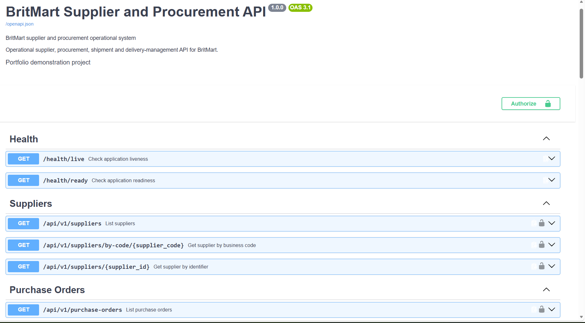

Fabric consumes the API through authenticated REST ingestion:

```text
PostgreSQL
    ↓
FastAPI
    ↓
Authenticated REST API
    ↓
Fabric ingestion pipeline
    ↓
Bronze JSON
    ↓
Silver Delta tables
```


---

# Metadata-Driven Ingestion

The Bronze ingestion framework is metadata-driven rather than being implemented as a separate hard-coded orchestration flow for every entity.

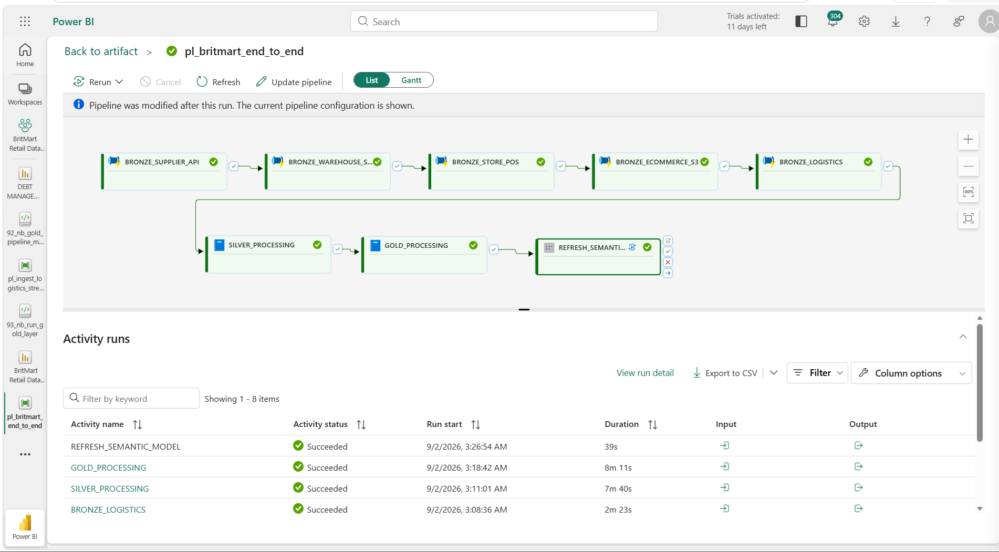

The master pipeline:

```text
SET_Pipeline_Run_ID
        ↓
SCR_Pipeline_Run_Start
        ↓
LKP_Active_Entities
        ↓
FE_Process_Entities
        ↓
SW_Route_Source_System
        ↓
Source-Specific Child Pipeline
        ↓
Audit Success / Failure
```

Metadata determines:

- source system
- entity
- load type
- execution sequence
- source path
- pagination configuration
- watermark column
- tie-breaker column
- business/primary keys
- Bronze destination
- file format
- active/inactive status

This separates **what should be processed** from **how a particular source technology is ingested**.

---

# Control Framework

The control framework is implemented in the Fabric Warehouse and contains six operational control tables.

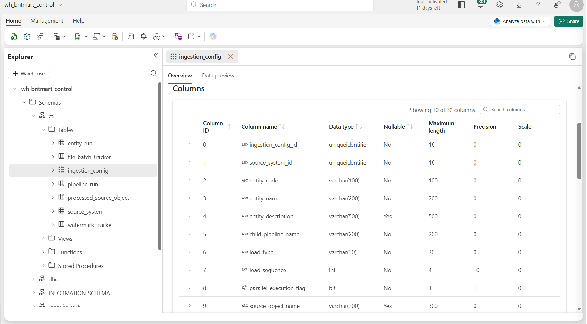

```text
ctl.source_system
ctl.ingestion_config
ctl.watermark_tracker
ctl.processed_source_object
ctl.pipeline_run
ctl.entity_run
```

### Responsibilities

**`ctl.source_system`**  
Defines registered operational source systems.

**`ctl.ingestion_config`**  
Stores entity-level ingestion metadata and execution configuration.

**`ctl.watermark_tracker`**  
Maintains incremental extraction state.

**`ctl.processed_source_object`**  
Tracks previously processed source objects to support idempotent file ingestion.

**`ctl.pipeline_run`**  
Stores pipeline-level execution telemetry.

**`ctl.entity_run`**  
Stores entity-level execution telemetry.

Together these tables provide configuration, state management, auditing and operational observability.

---

# Bronze Layer

The Bronze layer preserves source-aligned data before business transformation.

Key principles include:

- source fidelity
- traceability
- replayability
- incremental ingestion
- idempotent processing
- source-specific ingestion strategies
- operational audit capture

Source-specific child pipelines handle differences between REST APIs, relational databases and file-based sources while the master pipeline remains metadata-driven.

---

# Silver Layer

The Silver layer transforms raw Bronze data into validated, conformed Delta tables.

Processing includes:

- explicit schema handling
- type casting
- standardisation
- duplicate handling
- business-key validation
- referential-integrity checks
- audit columns
- record hashing
- quarantine logic
- Delta MERGE processing
- incremental/idempotent transformation

Selected technical audit columns include:

```text
_source_system
_processed_at_utc
_record_hash
```

Silver processing is organised by business/source domain rather than implemented as one monolithic notebook.

---

# Silver Data Quality

Data quality is implemented as executable engineering logic rather than relying only on visual inspection.

The validation framework covers areas including:

- duplicate keys
- null business keys
- referential integrity
- cross-table consistency
- invalid identifiers
- transformation integrity

Current validated result:

```text
28 / 28 checks PASS
```

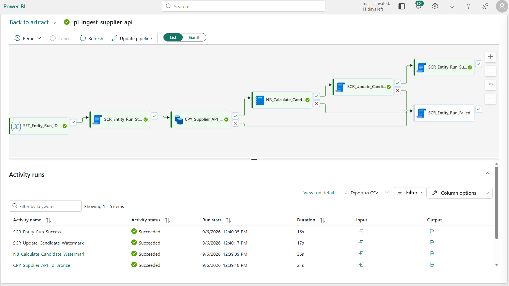

A failing hard validation is treated as an engineering defect requiring investigation rather than being silently ignored.

---

# Silver Reconciliation

A separate reconciliation framework compares expected/source-equivalent counts with Silver outputs.

Current validated result:

```text
16 / 16 reconciliation checks PASS
```

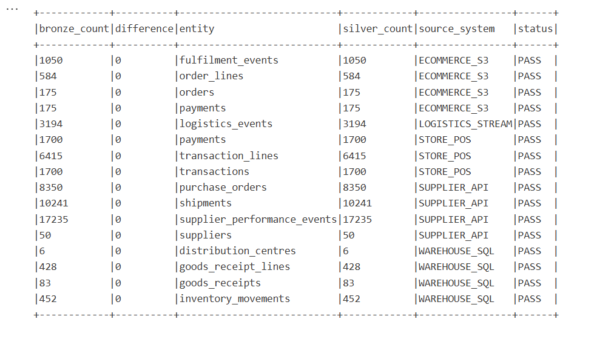

Reconciliation provides another control layer beyond schema and row-level data-quality checks.

---

# Gold Analytical Layer

The Gold layer provides business-ready dimensional models for analytics and reporting.

Core analytical areas include:

### Dimensions

- Date
- Supplier
- Distribution Centre
- Store
- Product
- Customer
- Sales Channel

### Facts

- Sales
- Purchase Orders
- Supplier Shipments
- Logistics Events
- Supplier Performance

The Gold layer is intentionally designed around business processes rather than simply exposing Silver tables directly to reporting.

---

# Operational Monitoring

The platform models its own execution telemetry in Gold so that pipeline health can be analysed alongside business data.

Pipeline and entity audit records are treated separately.

The original source `run_status` is preserved.

A separate `monitoring_status` is derived so historical executions left in `RUNNING` state can be classified as `STALE` without rewriting source audit history.

### Pipeline monitoring

Current validated state:

```text
109 pipeline runs
├── 82 SUCCESS
├── 18 FAILED
└──  9 STALE
```

### Entity monitoring

```text
204 source entity-run records
├── 197 valid Gold monitoring records
│   ├── 139 SUCCESS
│   ├──  54 STALE
│   ├──   3 SKIPPED
│   └──   1 FAILED
│
└── 7 quarantined records
```

Entity records whose parent pipeline audit record is unavailable are **quarantined rather than assigned fabricated relationships**.

The rejection reason is retained as:

```text
PARENT_PIPELINE_RUN_NOT_FOUND
```

Final monitoring persistence validation:

```text
Duplicate pipeline run IDs:                 0
Duplicate valid entity run IDs:             0
Duplicate rejected entity run IDs:          0
Valid entity parent pipeline orphans:       0
Valid/rejected entity overlap:              0
Classification reconciliation difference:  0
Hard persistence failure count:             0

PASS
```

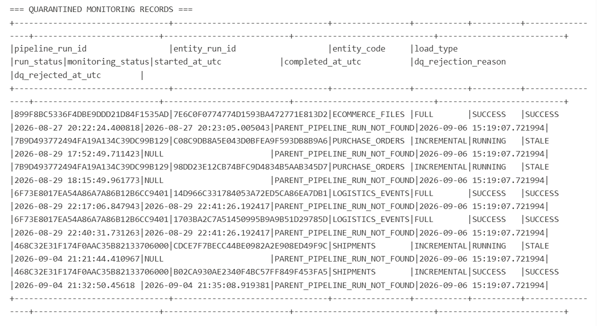

This design preserves source truth while still providing operationally useful monitoring classifications.

---

# End-to-End Orchestration

The final orchestration pipeline coordinates the complete analytical workflow.

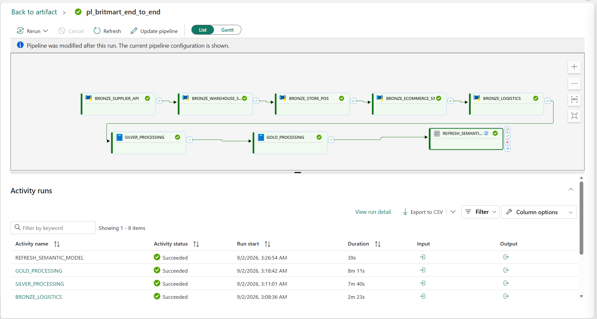

The execution sequence is:

```text
Supplier API Bronze
        ↓
Warehouse SQL Bronze
        ↓
Store POS Bronze
        ↓
E-commerce S3 Bronze
        ↓
Logistics Bronze
        ↓
Silver Processing
        ↓
Gold Processing
        ↓
Semantic Model Refresh
```

Sequential execution was intentionally used for this reference implementation to control resource consumption and preserve predictable dependency ordering.

---

# Semantic Model

The Gold analytical layer is exposed through a governed semantic model.

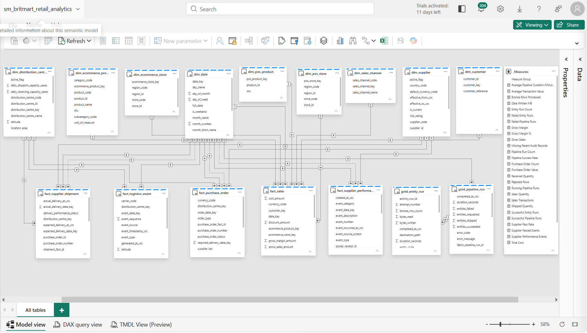

Relationships are based on legitimate business grain and dimensional relationships rather than creating artificial fact-to-fact relationships simply to make validation pass.

The model supports reporting across:

- platform operations
- executive performance
- sales
- procurement
- supplier performance
- logistics

---

# Power BI Reporting

The reporting layer contains four focused analytical pages.

## 1. Data Platform Monitoring

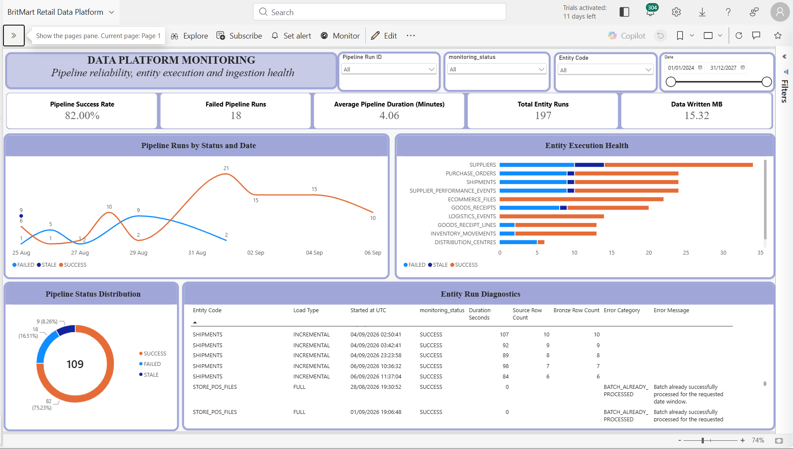

Provides visibility into:

- pipeline success rate
- failed pipeline runs
- stale executions
- average pipeline duration
- entity execution health
- ingestion volume
- pipeline status over time
- entity-level diagnostics

---

## 2. Executive Overview

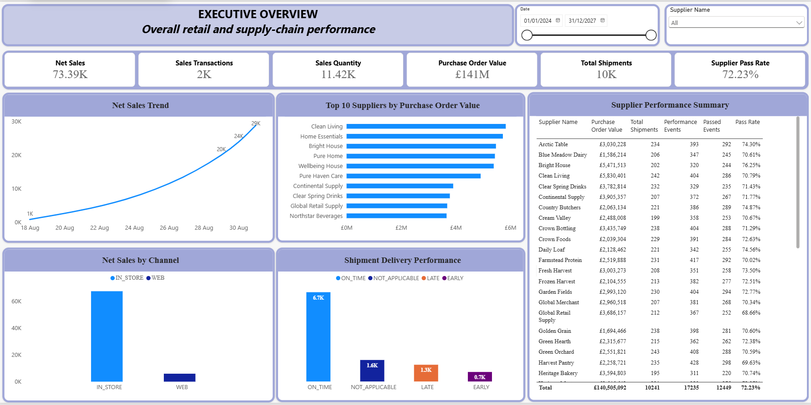

Provides senior-level visibility into key commercial and operational performance indicators.

---

## 3. Sales Analytics

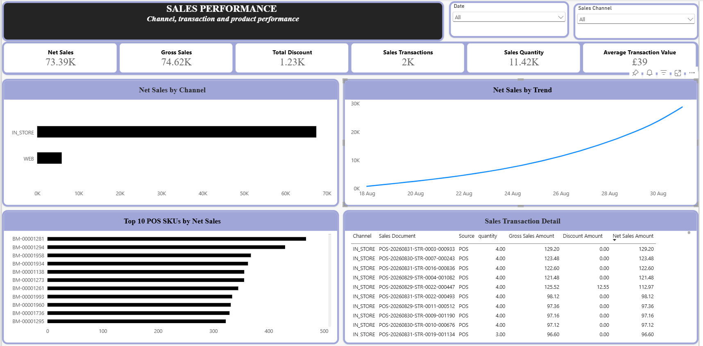

Supports analysis of retail sales performance across relevant business dimensions and channels.

---

## 4. Procurement & Supplier Performance


Provides visibility into procurement activity, supplier shipments and supplier-performance indicators.

---

# Git & Engineering Workflow

Git and GitHub are used to manage changes to the project rather than editing the stable branch directly for significant changes.

The workflow demonstrated in this repository is:

```text
main
  ↓
feature branch
  ↓
implementation
  ↓
git add
  ↓
commit
  ↓
push
  ↓
pull request
  ↓
diff/security review
  ↓
merge into main
  ↓
local main synchronisation
  ↓
feature branch cleanup
```

For example, the Gold monitoring implementation was developed on:

```text
feature/gold-monitoring
```

and merged into `main` through a Pull Request after validation and review.

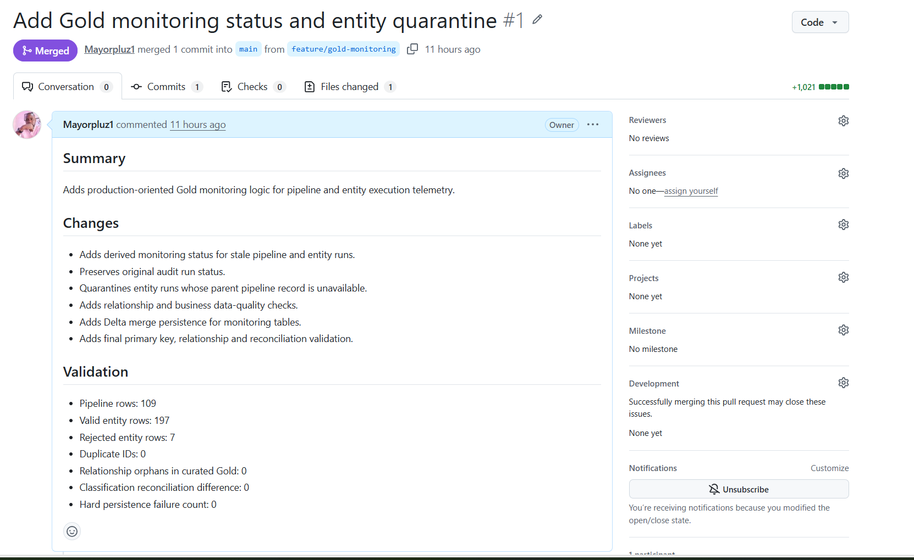

This provides traceable change history and isolates feature development from the stable branch.

---

# Technology Stack

### Data Engineering

- Microsoft Fabric
- Fabric Data Factory
- Apache Spark
- PySpark
- Delta Lake
- OneLake
- SQL
- Python

### Source Integration

- FastAPI
- PostgreSQL
- SQL Server
- SharePoint
- AWS S3
- Azure Blob Storage
- REST APIs
- JSON
- CSV

### Analytics

- Fabric Lakehouse
- Fabric Warehouse
- dimensional modelling
- semantic modelling
- Power BI

### Engineering Practices

- metadata-driven ingestion
- incremental loading
- watermarking
- idempotent processing
- schema validation
- data quality
- reconciliation
- quarantine handling
- audit logging
- operational monitoring
- Git
- GitHub
- feature branches
- Pull Requests

---

# Repository Structure

```text
britmart-retail-data-platform/
│
├── README.md
│
├── docs/
│   ├── architecture/
│   └── evidence/
│
├── fabric/
│   ├── control-framework/
│   ├── pipelines/
│   └── notebooks/
│       ├── silver/
│       ├── gold/
│       └── monitoring/
│
├── sql/
│   └── control-framework/
│
├── power-bi/
│
└── tests/
```

The Supplier API is maintained as a separate source-system repository:

[BritMart Supplier API](https://github.com/Mayorpluz1/britmart-supplier-api)

---

# Key Engineering Decisions

## Metadata over duplicated orchestration

Entity configuration is stored centrally so new ingestion entities can be introduced primarily through metadata rather than repeatedly redesigning the master pipeline.

## Preserve source truth

Original audit statuses are retained even when a separate operational classification such as `STALE` is required.

## Quarantine instead of fabrication

Records that cannot satisfy required relationships are quarantined with an explicit reason instead of inventing keys or silently dropping evidence.

## Reconciliation in addition to data quality

Row-level validation alone does not prove completeness. Separate reconciliation controls provide evidence that expected data reached the curated layer.

## Source-specific ingestion, common governance

REST APIs, SQL databases and files require different extraction mechanisms, but they share common configuration, audit and monitoring standards.

## Operational monitoring as data

Pipeline and entity execution telemetry is modelled and persisted so the platform itself can be analysed using the same engineering principles as business data.

---

# Security

No credentials, passwords, API keys, access tokens or connection strings are intentionally committed to this repository.

Sensitive configuration is kept outside source control.

Screenshots and examples are reviewed before publication to prevent exposure of authentication material.

---

# Portfolio Scope

BritMart is a fictional retail organisation created specifically for this portfolio/reference implementation.

The architecture, source systems, generated datasets, engineering logic, pipelines, transformations, validation controls, monitoring framework and reporting layer were developed to simulate realistic enterprise data-engineering requirements.

The project is intended to demonstrate practical capability in designing and implementing an end-to-end data platform rather than to represent a production system operated by a real company.
